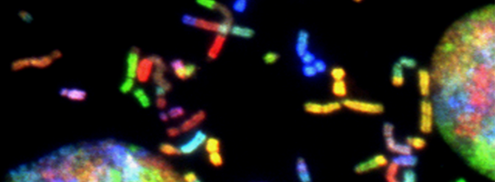

(c) Photo by <a href="https://unsplash.com/@nci?utm_source=unsplash&utm_medium=referral&utm_content=creditCopyText">National Cancer Institute</a> on <a href="https://unsplash.com/s/photos/neuron-dna?utm_source=unsplash&utm_medium=referral&utm_content=creditCopyText">Unsplash</a>

Hi there,

I'm Leo, postdoc at Institut Pasteur in Paris. I work on modelling complex biological systems, among others DNA repair mechanisms and neuronal processing.
I use a lot of Python in my projects, but I've been working with a large variety of different languages, e.g. R, Java, JavaScript, C++, Solidity, and Julia. 

Check out my research projects. The highlights are listed below.
- Repositories related to my PhD:
  -  [A Quantitative Modelling Approach for DNA Repair on a Population Scale](https://github.com/leoTiez/jmak)
  -  [Reaction-Diffusion ODE Parameter Search Framework](https://github.com/leoTiez/parameter-search-reaction-diffision)
  -  [Simulation of Sequencing Data Using the Gillespie Algorithm](https://github.com/leoTiez/dense-nucleus)
  -  [Random Reaction-Diffusion Interactions to Simulate Lesion Detection Assuming Heterochromatin](https://github.com/leoTiez/ChromReD4)
  -  [Calculate Nucleosome Free Regions in MNase-seq Data](https://github.com/leoTiez/nfree)
  -  [Create Plots for Linear Correlation Between Two Genomic Data Sets](https://github.com/leoTiez/linchange)
  -  [Compare different NGS data according to different evaluation techniques](https://github.com/leoTiez/chromosomal-data-comparison)
- [comparing the primary visual cortex in higher mammals and rodents](https://github.com/leoTiez/Dynamical-consequences-of-long-range-patchy-connections-in-the-neocortex)
- [incorporating a Bayesian inference rule into the Numenta framework](https://github.com/leoTiez/htmresearch)
- [reproduce the results of a recurrent convolutional neural network](https://github.com/leoTiez/dd2424)

Contact me on [leo.zeitler@pasteur.fr](leo.zeitler@pasteur.fr).

<!---
leoTiez/leoTiez is a ✨ special ✨ repository because its `README.md` (this file) appears on your GitHub profile.
You can click the Preview link to take a look at your changes.
--->
